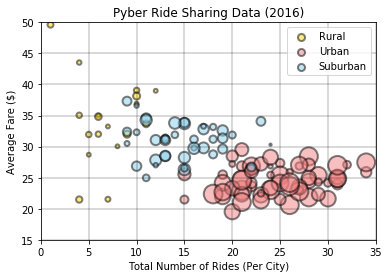
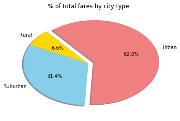
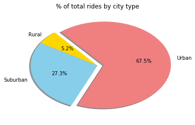
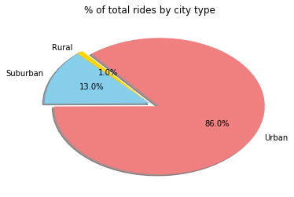

```python
#This is for HW5
import os
import pandas as pd
import matplotlib.pyplot as plt
import numpy as np

```


```python
# Read CSV files

city_path = os.path.join('raw_data', 'city_data.csv')
ride_path = os.path.join('raw_data', 'ride_data.csv')

city_data = pd.read_csv(city_path)
ride_data = pd.read_csv(ride_path)


# city_data = city_data.set_index('city')
city_data.head(5)
```


<div>
<style scoped>
    .dataframe tbody tr th:only-of-type {
        vertical-align: middle;
    }

    .dataframe tbody tr th {
        vertical-align: top;
    }

    .dataframe thead th {
        text-align: right;
    }
</style>
<table border="1" class="dataframe">
  <thead>
    <tr style="text-align: right;">
      <th></th>
      <th>city</th>
      <th>driver_count</th>
      <th>type</th>
    </tr>
  </thead>
  <tbody>
    <tr>
      <th>0</th>
      <td>Kelseyland</td>
      <td>63</td>
      <td>Urban</td>
    </tr>
    <tr>
      <th>1</th>
      <td>Nguyenbury</td>
      <td>8</td>
      <td>Urban</td>
    </tr>
    <tr>
      <th>2</th>
      <td>East Douglas</td>
      <td>12</td>
      <td>Urban</td>
    </tr>
    <tr>
      <th>3</th>
      <td>West Dawnfurt</td>
      <td>34</td>
      <td>Urban</td>
    </tr>
    <tr>
      <th>4</th>
      <td>Rodriguezburgh</td>
      <td>52</td>
      <td>Urban</td>
    </tr>
  </tbody>
</table>
</div>


```python
# Retrieve the desired values in dataframe, groupBy city
merged_df = pd.merge(ride_data, city_data, on="city")
TotalRides = ride_data['ride_id'].count()
TotalRides

# Average Fare ($) Per City
perCity_df = merged_df.groupby('city').fare.mean()
perCity_df = perCity_df.to_frame('Avg Fare')

# Total Number of Rides Per City
perCity_df['Total Rides'] = merged_df.groupby('city').ride_id.count()
perCity_df['city'] = perCity_df.index

# Total Number of Drivers Per City and City type
perCity_df = pd.merge(perCity_df, city_data, on="city")


perCity_df = perCity_df.set_index('type')
perCity_df.head(3)

```


<div>
<style scoped>
    .dataframe tbody tr th:only-of-type {
        vertical-align: middle;
    }

    .dataframe tbody tr th {
        vertical-align: top;
    }

    .dataframe thead th {
        text-align: right;
    }
</style>
<table border="1" class="dataframe">
  <thead>
    <tr style="text-align: right;">
      <th></th>
      <th>Avg Fare</th>
      <th>Total Rides</th>
      <th>city</th>
      <th>driver_count</th>
    </tr>
    <tr>
      <th>type</th>
      <th></th>
      <th></th>
      <th></th>
      <th></th>
    </tr>
  </thead>
  <tbody>
    <tr>
      <th>Urban</th>
      <td>23.928710</td>
      <td>31</td>
      <td>Alvarezhaven</td>
      <td>21</td>
    </tr>
    <tr>
      <th>Urban</th>
      <td>20.609615</td>
      <td>26</td>
      <td>Alyssaberg</td>
      <td>67</td>
    </tr>
    <tr>
      <th>Suburban</th>
      <td>37.315556</td>
      <td>9</td>
      <td>Anitamouth</td>
      <td>16</td>
    </tr>
  </tbody>
</table>
</div>


```python
# Separate DataFrames
urban_df = perCity_df.loc['Urban']
suburban_df = perCity_df.loc['Suburban']
rural_df = perCity_df.loc['Rural']
```


```python
## Bubble Plot
x_rur = rural_df['Total Rides']
y_rur = rural_df['Avg Fare']
z_rur = rural_df['driver_count']*5

x_sub = suburban_df['Total Rides']
y_sub = suburban_df['Avg Fare']
z_sub = suburban_df['driver_count']*5

x_urb = urban_df['Total Rides']
y_urb = urban_df['Avg Fare']
z_urb = urban_df['driver_count']*5


Ru = plt.scatter(x_rur, y_rur, s=z_rur, alpha=0.5, c='gold', edgecolors="black", linewidth = 2)
Ur = plt.scatter(x_urb, y_urb, s=z_urb, alpha=0.5, c='lightcoral', edgecolors="black", linewidth = 2)
Su = plt.scatter(x_sub, y_sub, s=z_sub, alpha=0.5, c='skyblue', edgecolors="black", linewidth = 2)

plt.title("Pyber Ride Sharing Data (2016)")
plt.xlabel("Total Number of Rides (Per City)")
plt.ylabel("Average Fare ($)")

xmin = 0
xlim = 35
ymin = 15
ylim = 50
plt.xlim(xmin,xlim)
plt.ylim(ymin,ylim)

horLines = np.arange(ymin,ylim+5, 5)
verLines = np.arange(xmin,xlim+5, 5)

lgnd = plt.legend((Ru, Ur, Su),
          ('Rural', 'Urban', 'Suburban'))

lgnd.legendHandles[0]._sizes = [50]
lgnd.legendHandles[1]._sizes = [50]
lgnd.legendHandles[2]._sizes = [50]

plt.hlines(horLines, 0, xlim, alpha=0.2)
plt.vlines(verLines, 0, ylim, alpha=0.2)

plt.show()

```





```python
## PIE CHART 1
# % of total fares by city type
fares_df = merged_df.groupby('type').fare.sum()
fares_df = fares_df.to_frame('Total Fares')

labels = fares_df.index
explode = [0, 0, 0.1]
colors = ["gold", "skyblue", "lightcoral"]
plt.pie(fares_df['Total Fares'], explode=explode, labels=labels, colors=colors,
        autopct='{:.1f}%'.format, shadow=True, startangle=130)
plt.title('% of total fares by city type')
plt.show()
plt.tight_layout()


```





    <matplotlib.figure.Figure at 0x26ebdee90f0>


```python
## PIE CHART 2
# % of total rides by city type
rides_df = merged_df.groupby('type').date.count()
rides_df = rides_df.to_frame('Total Rides')

labels = rides_df.index
explode = [0, 0, 0.1]
colors = ["gold", "skyblue", "lightcoral"]
plt.pie(rides_df['Total Rides'], explode=explode, labels=labels, colors=colors,
        autopct='{:.1f}%'.format, shadow=True, startangle=130)
plt.title('% of total rides by city type')
plt.show()
plt.tight_layout()

```





    <matplotlib.figure.Figure at 0x26ebdf42ba8>


```python
## PIE CHART 3
# % of total drivers per city type
drivers_df = merged_df.groupby('type').driver_count.sum()
drivers_df = drivers_df.to_frame('Total Drivers')


labels = drivers_df.index
explode = [0, 0, 0.1]
colors = ["gold", "skyblue", "lightcoral"]
plt.pie(drivers_df['Total Drivers'], explode=explode, labels=labels, colors=colors,
        autopct='{:.1f}%'.format, shadow=True, startangle=130)
plt.title('% of total rides by city type')
plt.show()
plt.tight_layout()
```





    <matplotlib.figure.Figure at 0x26ebe007b70>


```python
# Don't forget
# include written description of 3 observalble trends
# You must include an exported markdown version of your Notebook called  README.md in your GitHub repository.
```
